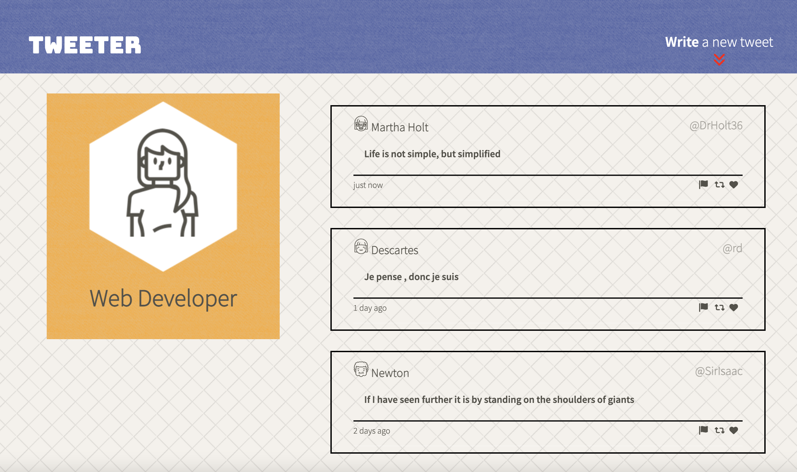
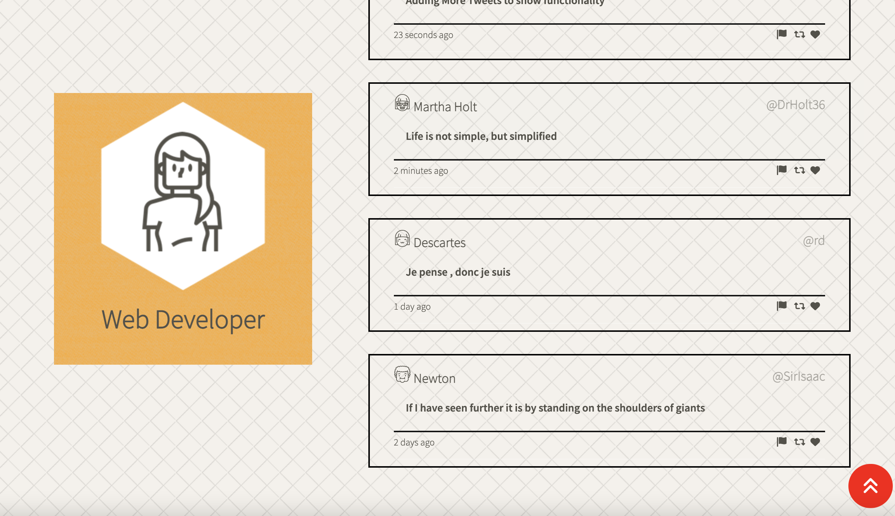
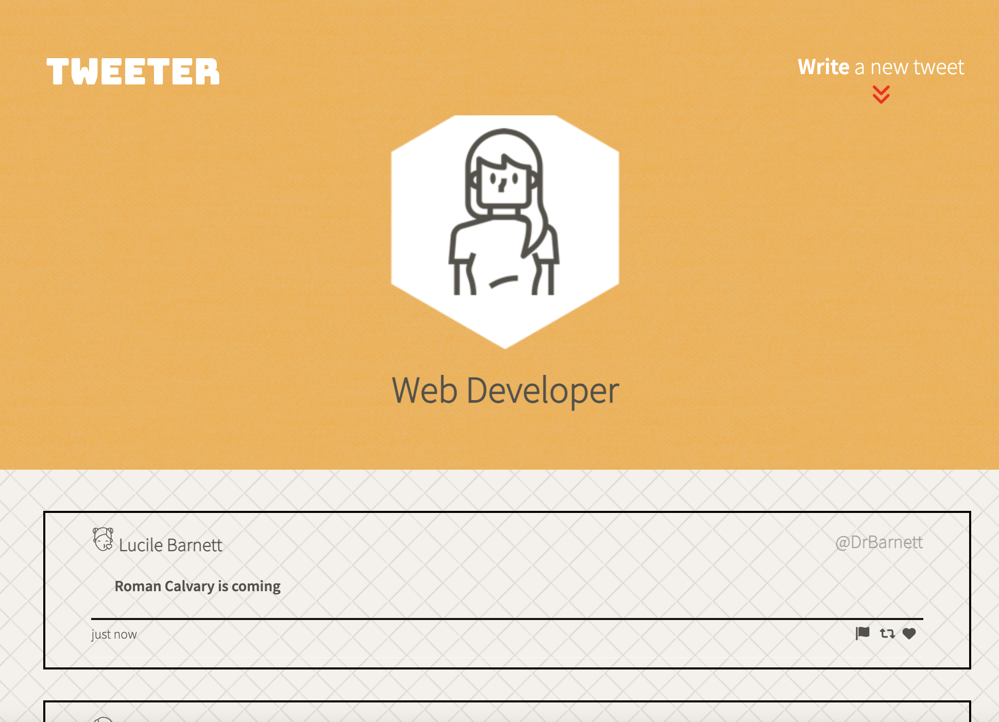
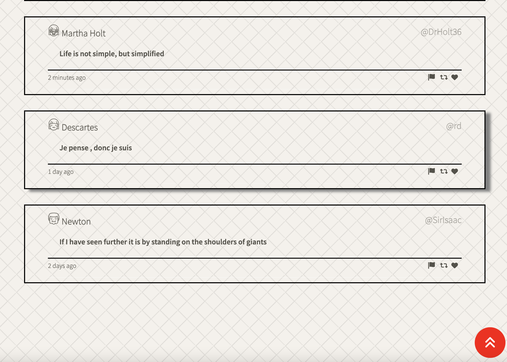

# Tweeter Project

Tweeter is a simple, single-page Twitter clone.

This project is meant to help the student learn about CSS, HTML, AJAX,
JQuery, Http, Express Servers, SASS, Client side rendering and server resource management.

## Screenshots

### Large Screen

### Large Screen Scrolled down

### Small Screen - Single column layout

### Small Screen Scrolled Down

## Getting Started

1. Install dependencies using the `npm install` command.
2. Start the web server using the `npm run local` command. The app will be served at <http://localhost:8080/>.
3. Go to <http://localhost:8080/> in your browser.

## Dependencies

- Express
- Body-Parser
- Chance
- Node 5.10.x or above
- Nodemon

## Features
- Page reconfigures at different sized screens
- Protection against HTML code injections
- Client Side Rendering
- Pulls tweets from a database
- Jquery and Ajax Http requests to server
- Dynamic Error messages
